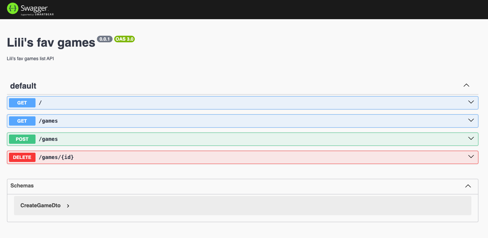
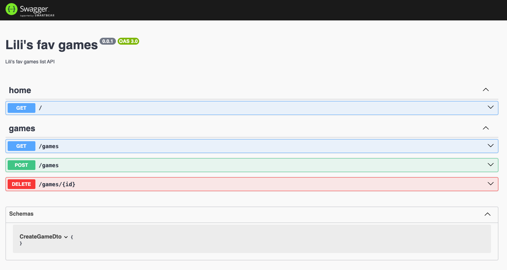
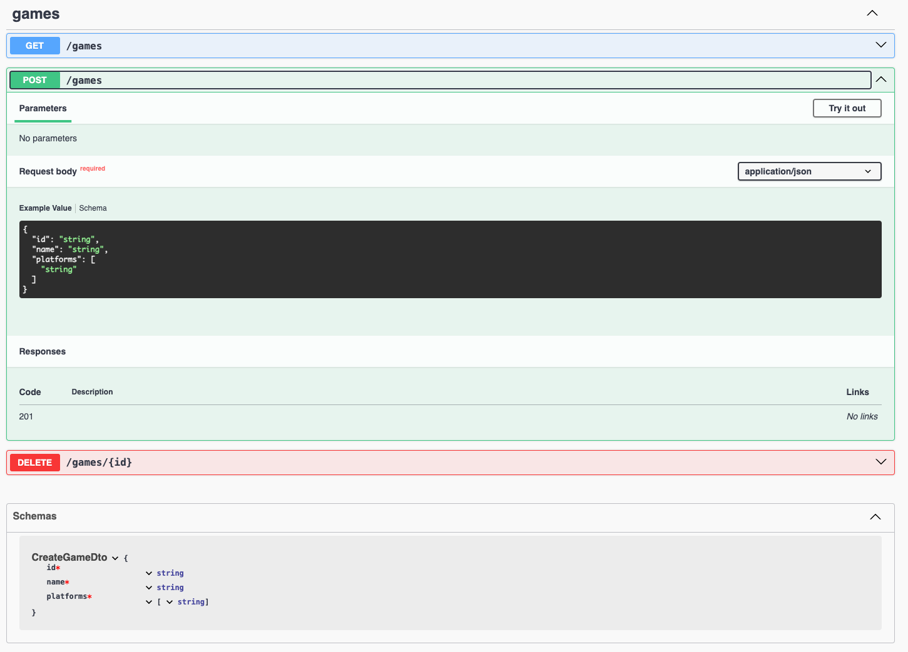
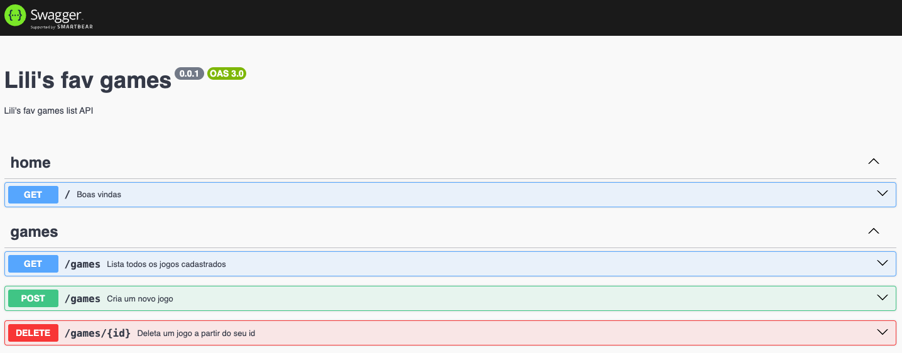
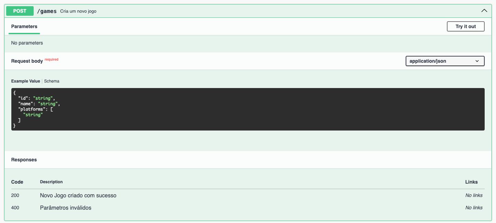
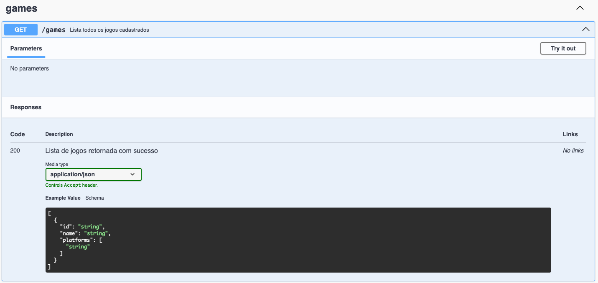
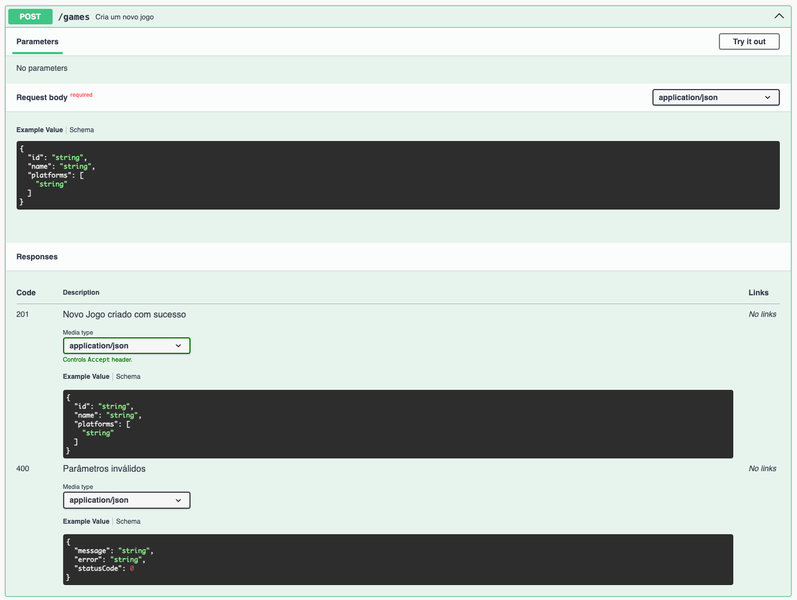
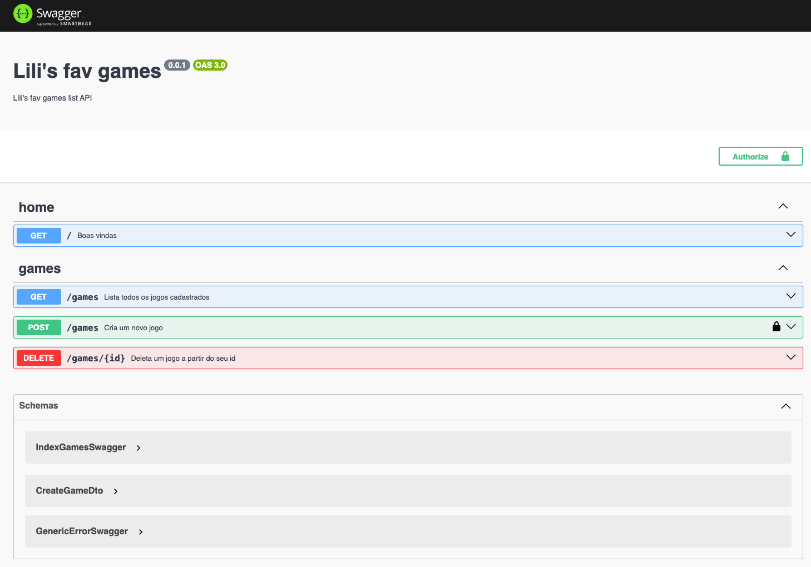

<h1 align="center">
  
</h1>

# On36 | Imersão JavaScript | Semana 13 Projeto Final | 2024 |

Hello agaaaain! Sou Lili (Lilit Bandeira) e estarei com vocês como professora dessa semana, numa breve apresentação eu sou Engenheira de Software no @nubank, sou ex aluna e hoje colaboro com o reprograma como professora e líder técnica.

Meus contatos:

<div>
  
  <a href="https://www.linkedin.com/in/lilitbandeira"></a>
  <a href="https://www.instagram.com/lilitbandeira/"></a>
  <a href="mailto:devlilitbandeira@gmail.com"></a>
</div>

## Objetivo
* O Objetivo desta aula é orientar e poder discutir soluções e caminhos para os projetos de vocês e poder tirar dúvidas, além de orientas sobre boas práticas.

## Plano de Aula

- [Conteúdo](#conteúdo)
  - [Documentação com Swagger](#documentação-com-swagger)
- [Nest Projetc](#nest-projetc)

## Instruções
Antes de começar, vamos organizar nosso setup.
* Fork esse repositório 
* Clone o fork na sua máquina (Para isso basta abrir o seu terminal e digitar `git clone url-do-seu-repositorio-forkado`)
* Entre na pasta do seu repositório (Para isso basta abrir o seu terminal e digitar `cd nome-do-seu-repositorio-forkado`)
* [Add outras intrucoes caso necessario]

# Conteudo

## Documentação com Swagger 

**Para criar uma documentação swagger para nossa API, utilizaremos a [documentação do nestjs](https://docs.nestjs.com/openapi/introduction) que segere os seguintes passos:**

1. Instalar a dependência do swagger:

```
npm install --save @nestjs/swagger
```

2. Copiar para o arquivo raiz do projeto `main.ts` o modulo do swagger:

```typescript
const config = new DocumentBuilder()
    .setTitle("Lili's fav games")
    .setDescription("Lili's fav games list API")
    .setVersion('0.0.1')
    .build();
const document = SwaggerModule.createDocument(app, config);
SwaggerModule.setup('api', app, document);
```

3. Ao rodar o seu projeto, a documentação será gerada e poderá ser acessada usando a rota configurada no `SwaggerModule`, exemplo:

```
localhost:3000/api
```
> com isso uma documentação já deve ter sido gerada, mapeando todos os endpoints e pronta para ser executada.

 
> A partir daqui muitas configurações podem ser feitas de acordo com a necessidade de cada projeto, mas faremos algumas configurações mais comuns para deixar nossa documentação mais rica!

4. Adicionando tags ao nosso grupo de rotas:

```typescript
@ApiTags()
```




5. Criando exemplos de schema a partir dos DTOs:

```typescript
@ApiProperty()
```


6. Descrevendo cada rota:

```typescript
@ApiOperation({ summary: 'descrição'})
```


7. Descrevendo as respostas de cada endpoint:

```typescript
@ApiResponse({ status: 200, description: 'descrição da resposta'})
```


8. Definindo schema de respostas de "sucesso" cada endpoint:

```typescript
@ApiResponse({ status: 200, description: 'descrição da resposta', type: EntitySchemaSwagger})
```
> `EntitySchemaSwagger` representa uma Entidade que define o schema da nossa resposta, podemos utilizar a própria entidade em questão, mas é indicado criar uma Class só para o Swagger que extend a Entidade para poder manipular de acordo com a necessidade da documentação.



9. Podemos criar um schema de resposta de erro genérico seguindo o padrão do nestjs:

```typescript
@ApiResponse({ status: 400, description: 'descrição da resposta', type: GenericErrorSwagger})
```
> `GenericErrorSwagger` representa uma Entidade que define o schema da nossa resposta de erro, podemos criar um paseado no tipo de erro padrão do next:

```typescript
{
  "message": "Dados insuficientes!",
  "error": "Bad Request",
  "statusCode": 400
}
``` 

> Para adiantar nosso trabalho na criação de um schema, podemos usar o json2ts.vercel.app para gerar uma class em Typescript a partir do json do erro.



10. Podemos fazer diversas outras configurações para personalizar os schemas no swagger, algumas comuns são:

```typescript
PartialType() // Permite definir campos nullables
OmitType() // Permite omitir campos não necessários de um schema existente
```

11. Outra configuração comum é quanto a autenticação necessária para endpoint, como configurar chaves JWT:

```typescript
DocumentationBuilder().addBearerAuth(
  {
  type: 'http',
  scheme: 'bearer',
  bearerFormat: 'JWT',
  name: 'Authorization',
  description: 'Insert token',
  in: 'header' 
  },
  'KEY_AUTH_TOKEN'
) // Adiciona no document de configuração do swagger

@ApiBearerAuth('KEY_AUTH_TOKEN') //Adiciona no endpoint que necessita de autenticação 
```



A documentação do neste possui um [exemplo prático](https://github.com/nestjs/nest/tree/master/sample/11-swagger) que recomendo ser consultado sempre que necessário!

# Nest Projetc 

## Setup

```bash
$ npm install
```

## Compilar e rodar

```bash
# development
$ npm run start

# watch mode
$ npm run start:dev

# production mode
$ npm run start:prod
```

## Rodar testes

```bash
# unit tests
$ npm run test

# e2e tests
$ npm run test:e2e

# test coverage
$ npm run test:cov

<p align="center">
Desenvolvido com :purple_heart:  
</p>

